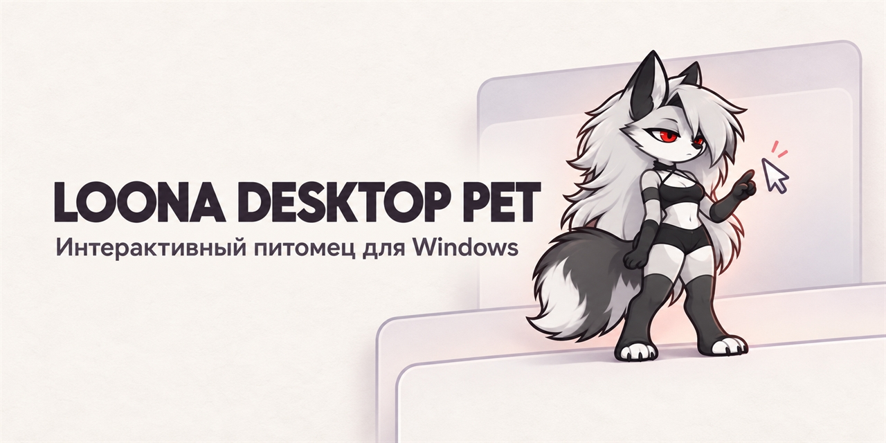

# Loona Desktop Pet

**Loona — интерактивный питомец для рабочего стола Windows.** Она самостоятельно гуляет по экрану, иногда бегает и оживает в ответ на курсор, набор текста и прямое взаимодействие.



## Что умеет Loona

- Гуляет по рабочему столу, иногда пробегается, достаёт гримуар и может надолго устроиться на окне.
- Замечает курсор и печать. Если погладить её, появляются улыбка и сердечки; после долгого поглаживания Loona может показать один цикл недовольства.
- Открывает меню по правому щелчку. Левой кнопкой её можно перетаскивать и бросать.
- Взаимодействует с окнами: скользит, падает, восстанавливает равновесие и держится за движущееся окно, когда сидит на нём.

## Быстрый запуск

В корне репозитория находится готовая сборка Windows. Запустите `Loona-Desktop.exe`. Не переносите EXE отдельно: рядом должны оставаться папки `_internal` и `assets`, а также файл `VERSION`. Для запуска готовой сборки Python не требуется.

Пользовательские настройки и журнал собранного приложения хранятся в `%LOCALAPPDATA%\LoonaDesktopPet`.

## Исходники и сборка

Исходный проект находится в папке `Loona-Desktop`. Для запуска из исходников откройте эту папку и запустите `Start-Loona.cmd`.

Для локальной сборки Windows x64 нужен Python 3.12. В PowerShell из папки `Loona-Desktop` выполните:

```powershell
py -3.12 build.py
```

Сборка создаёт приложение и ZIP-архив локально в `dist`; сама команда ничего не публикует. Подробности приведены в [инструкции по сборке](Loona-Desktop/BUILDING.md).

## Версия

Текущая версия — `1.0.0`. История изменений: [CHANGELOG.md](Loona-Desktop/CHANGELOG.md).
